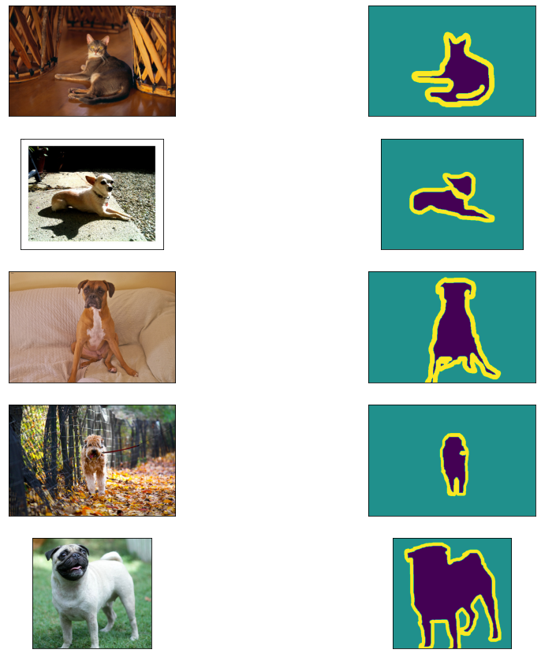

# Model Optimization Pipeline for Image Segmentation

This repository contains a complete pipeline for training, pruning, quantizing, and evaluating a U-Net model for image segmentation using the Oxford-IIIT Pet Dataset. The goal is to demonstrate how different model optimization techniques can reduce model size and improve inference speed without significantly compromising accuracy.

## Table of Contents

- [Introduction](#introduction)
- [Features](#features)
- [Requirements](#requirements)
- [Setup](#setup)
- [Usage](#usage)
  - [Data Preparation](#data-preparation)
  - [Model Training](#model-training)
  - [Pruning](#pruning)
  - [Quantization](#quantization)
  - [Evaluation](#evaluation)
- [Data Sample](#data-sample)
- [Results](#results)
- [License](#license)

## Introduction

Model optimization techniques like pruning and quantization are essential for deploying deep learning models on resource-constrained devices. This repository provides a practical example of applying these techniques to an image segmentation task.

## Features

- **Data Preparation**: Scripts to load and preprocess the Oxford-IIIT Pet Dataset.
- **Model Definition**: A simple U-Net model implemented in TensorFlow.
- **Training**: Scripts to train the model.
- **Pruning**: Applying unstructured pruning to reduce model size.
- **Quantization**: Applying dynamic range, full integer, and float16 quantization.
- **Evaluation**: Measuring model size, inference time, and accuracy.

## Requirements

- Python 3.6 or higher
- TensorFlow 2.x
- TensorFlow Datasets
- TensorFlow Model Optimization Toolkit
- NumPy

Install the dependencies using:

```bash
pip install -r requirements.txt
```

## Setup

Clone the repository:

```bash
git clone https://github.com/your-username/model-optimization-pipeline.git
cd model-optimization-pipeline
```

Install the required packages:

```bash
pip install -r requirements.txt
```

## Usage

### Data Preparation

The data preparation script loads and preprocesses the dataset.

```bash
python data_preparation.py
```

This script resizes the images, normalizes them, and prepares them for training.

### Model Training

Train the original model:

```bash
python training.py
```

This script defines and trains a U-Net model using the Oxford-IIIT Pet Dataset. The trained model is saved at `models/original_model.h5`.

### Pruning

Apply unstructured pruning to the trained model:

```bash
python pruning.py
```

This script applies unstructured pruning to reduce the size of the model by removing less important weights. The pruned model is saved at `models/pruned_model.h5`.

### Quantization

Apply different quantization techniques:

```bash
python quantization.py
```

This script converts the pruned model to different quantized versions:
- `models/dynamic_quantized_model.tflite`
- `models/int8_quantized_model.tflite`
- `models/float16_quantized_model.tflite`

### Evaluation

Evaluate the models in terms of size, inference time, and accuracy:

```bash
python evaluation.py
```

This script evaluates the original, pruned, and quantized models, providing insights into model size, inference speed, and accuracy.

## Data Sample

Below is an example of how the dataset looks:



The image shows an input image and its corresponding segmentation mask from the Oxford-IIIT Pet Dataset.

## Results

The evaluation script will display the results, including model sizes, inference times, and accuracy metrics.

Example output:

```
Model Sizes:
Original Model Size: 12.97 mb
Pruned Model Size: 6.71 mb
Dynamic Quantized Model Size: 2.86 mb
Int8 Quantized Model Size: 1.76 mb
Float16 Quantized Model Size: 3.78 mb

Dynamic Range Quantized Model - Inference Time: 0.1234s, Accuracy (Mean IoU): 0.7890
Int8 Quantized Model - Inference Time: 0.0987s, Accuracy (Mean IoU): 0.7800
Float16 Quantized Model - Inference Time: 0.1100s, Accuracy (Mean IoU): 0.7850
```

## License

This project is licensed under the MIT License - see the [LICENSE](LICENSE) file for details.
